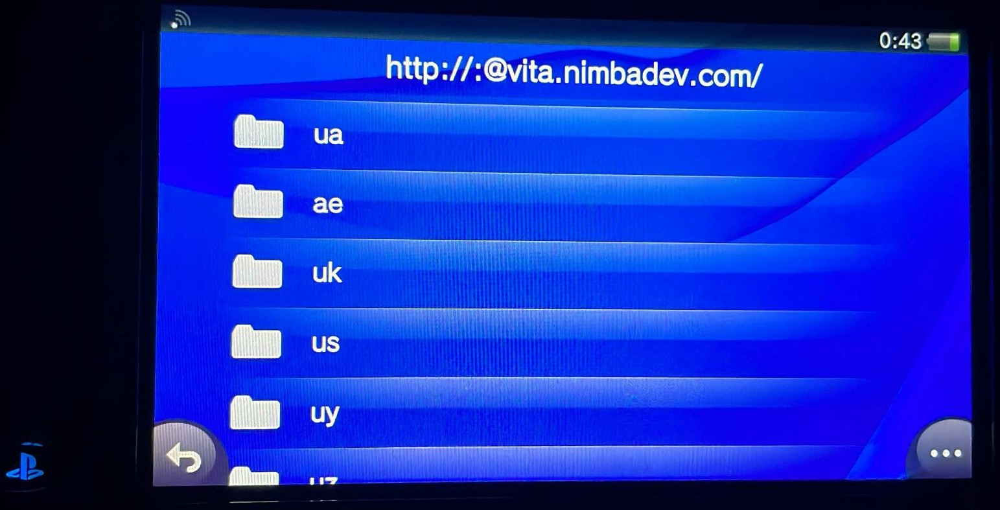
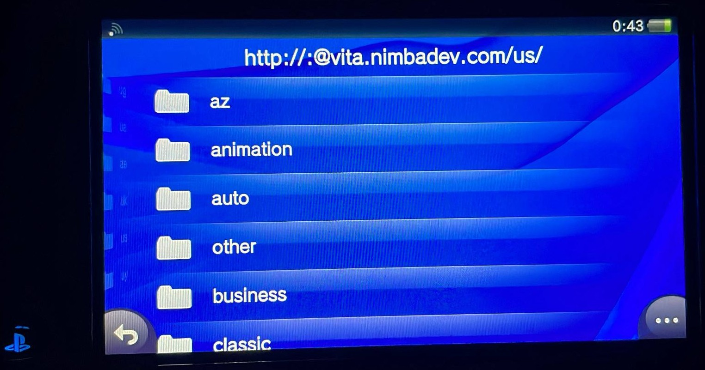
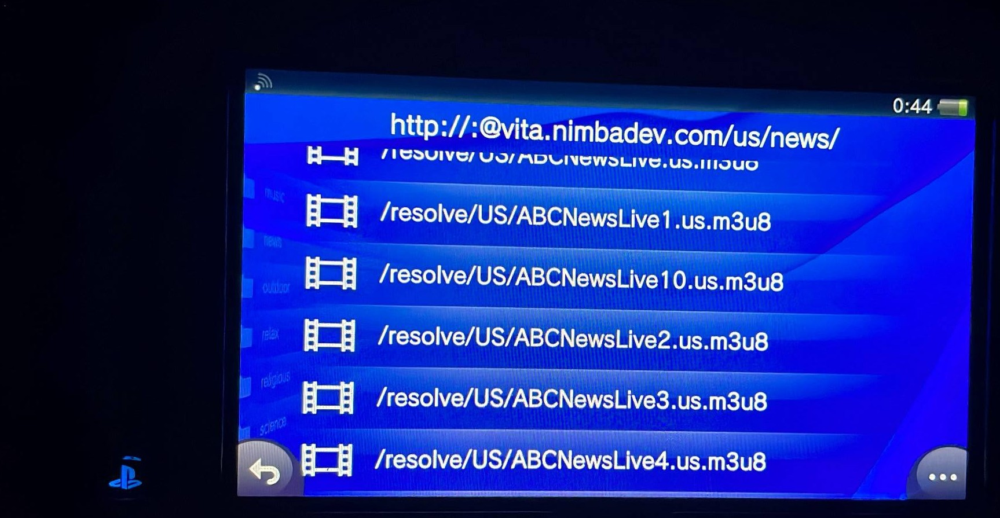

# psvita-stream-bridge

*[Version française](README.fr.md)*

A small HTTP bridge that lets [NetStream](https://github.com/GrapheneCt/NetStream)
— a video streaming client for the **PS Vita** — browse and play live TV
channels, organized by country, category, and an A-Z index.

NetStream's "HTTP server" mode is deliberately minimal: it parses plain
HTML `<a href>` links, has no search box, and no concept of categories. This
project doesn't touch NetStream itself — it exposes a small API that speaks
exactly the format NetStream already understands, backed today by
[iptv-org](https://github.com/iptv-org/iptv)'s public channel list (~10,000
channels, ~180 countries, no licensed content).

## Why this exists

Streaming to a 2012 handheld console over a minimal HTTP-browsing client
means the usual approach (a media-server protocol, a rich API, a search
endpoint) is off the table. This bridge exists to work around exactly that
— see [`docs/ARCHITECTURE.md`](docs/ARCHITECTURE.md) for the specific
NetStream constraints (found by reading its source) that shaped every
design decision here.

## Features

- Navigation tree NetStream can actually browse: pick **country** or
  **language** first, then `category or A-Z → channel → stream`. Country and
  language are two independent views over the same channels — a bilingual
  channel shows up under both languages, just like it can under several
  categories.
- HLS manifest rewriting so relative sub-playlist paths resolve correctly
  on NetStream's player (see [`docs/ARCHITECTURE.md`](docs/ARCHITECTURE.md)
  for why this is needed).
- **Channel health detection**: every channel is checked in the background
  on a schedule; dead or geo-blocked channels are automatically hidden from
  navigation instead of showing up as a broken link on the console. A
  `/_status` endpoint reports what's up, what's down, and why — handy for
  telling a bad channel apart from a console/firmware issue.
- No video proxying: the bridge only ever touches the small text manifest;
  actual video segments stream directly from the source CDN to the Vita.

## Screenshots

Real photos of the actual navigation running on a PS Vita through NetStream:

<table>
<tr>
<td><br><sub>Country list (<code>/country/</code>)</sub></td>
<td><br><sub>A country's categories (<code>/country/us/</code>)</sub></td>
<td><br><sub>Channels ready to play (<code>/country/us/news/</code>)</sub></td>
</tr>
</table>

## Quick start

```bash
git clone https://github.com/TheRealBerete/psvita-stream-bridge.git
cd psvita-stream-bridge
pip install -r requirements.txt
python build_channels.py      # pulls channel/category/country data from iptv-org
uvicorn app:app --host 0.0.0.0 --port 8000
```

Or with Docker:

```bash
docker compose up --build -d
```

See [`docs/DEPLOYMENT.md`](docs/DEPLOYMENT.md) for production deployment
notes, including a documented gotcha for [Dokploy](https://dokploy.com/) +
Traefik setups.

## Pointing NetStream at it

On the PS Vita, in NetStream's settings → HTTP server:

- **Host address**: `http://<ip-or-domain>` — the scheme (`http://` /
  `https://`) is **required**; a bare IP makes the connection silently fail.
- **Port**: `8000` locally, or `443` behind an HTTPS reverse proxy.

## Health diagnostics

```bash
curl https://your-domain/_status          # summary: total / ok / broken, with error samples
curl -X POST https://your-domain/_admin/recheck   # trigger a manual re-check
```

If a channel shows `ok: true` here but still fails to play on the console,
the issue is most likely on the client side (HLS player/firmware), not the
stream — see [`docs/ARCHITECTURE.md`](docs/ARCHITECTURE.md#channel-health-detection).

## Project scope

This is, and is meant to stay, a **TV channel streaming bridge**. It only
ever serves publicly listed IPTV channel URLs (public domain data from
iptv-org) — it does not fetch, proxy, or redistribute licensed video-on-demand
content of any kind, and contributions in that direction won't be merged.

## Documentation

- [`docs/ARCHITECTURE.md`](docs/ARCHITECTURE.md) — how it works, and the
  NetStream client constraints that shaped the design.
- [`docs/DEPLOYMENT.md`](docs/DEPLOYMENT.md) — local, Docker, and
  Dokploy/Traefik deployment notes.
- [`CHANGELOG.md`](CHANGELOG.md) — notable changes and the real bugs found
  (and fixed) on actual hardware.
- [`CONTRIBUTING.md`](CONTRIBUTING.md) — how to contribute.

## Credits

- [NetStream](https://github.com/GrapheneCt/NetStream) by GrapheneCt — the
  PS Vita client this bridge is built to serve.
- [iptv-org](https://github.com/iptv-org) — the public, unlicensed
  (public-domain) channel data this MVP uses by default.

## License

[MIT](LICENSE) for the code in this repository. Channel data comes from
[iptv-org](https://github.com/iptv-org), released into the public domain
under [The Unlicense](https://github.com/iptv-org/iptv/blob/master/LICENSE).
